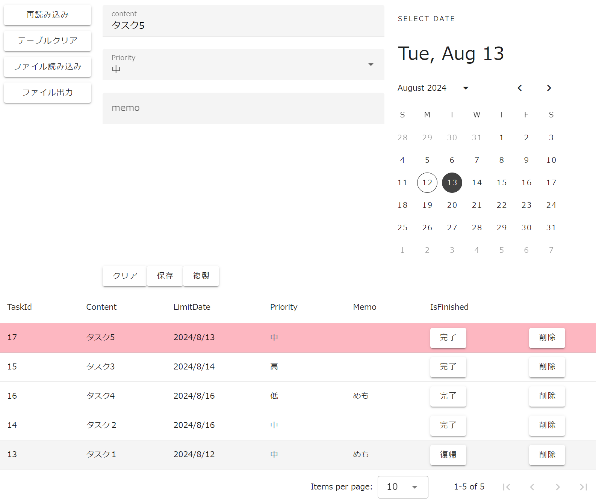

# vue-sqlite3-wasm

Sqlite-wasmを利用したやることリストのサンプルVueプロジェクトです．  



content/priority/memoとカレンダーの日付を設定して保存ボタンを押すと下の表に追加されます．  
表の「やること」を選択すると，入力項目に反映されます．  
編集して保存ボタンを押すと更新され，複製ボタンを押すと新規で追加されます．  

表は，IsFinished(完了状態)，LimitDate(期日)，Priority(優先度)の順番にソートされます．  
完了ボタンを押すと完了状態に遷移して，復帰ボタンを押すと未完了状態に遷移します．  
不要になった「やること」は削除ボタンで削除できます．

テーブルクリアボタンを押すと「やること」をすべて削除できます．  
ファイル読み込みボタンを押すとSQLite-wasmのデータをダウンロードできます．  
ファイル出力ボタンを押すとダウンロードしたSQLite-wasmのデータをアップロードして上書きします．

## セットアップ
```
npm install
```

ブラウザでOPFSを確認したい場合，OPFS Explorerなどの拡張機能をインストールする．  

## 起動
```
npm run dev
```

## 構成
* Typescript
* Vue3(Composition APIを使用)
* Vuetify
* Sqlite-wasm

## ファイル構成

**main.ts**  
Vueのエントリポイント

**App.vue**  
やることリストの画面ファイル

**constants.ts**  
定数定義ファイル

**composable**  
App.vueのCompositionを分離したもの

**sqlite3フォルダ**  
sqlite-wasmをラップしたSqliteDriverを定義したもの

**clientsフォルダ**  
SqliteDriverをラップしたもの  
Web APIへの切り替えはここを拡張することを想定